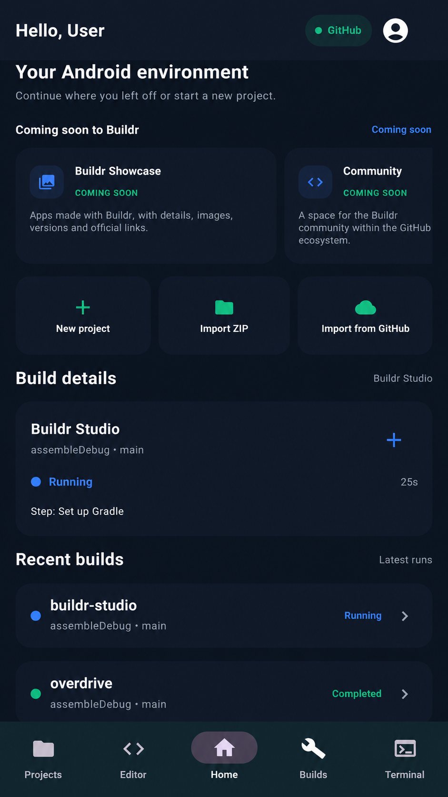
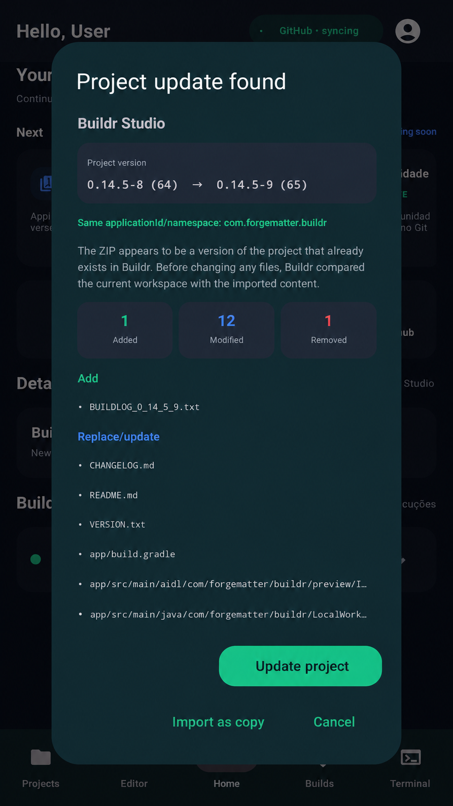
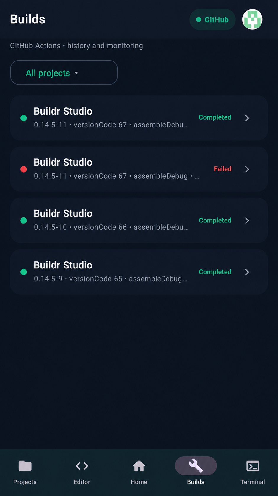
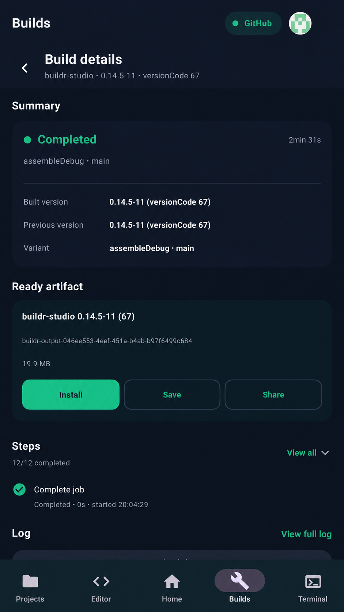
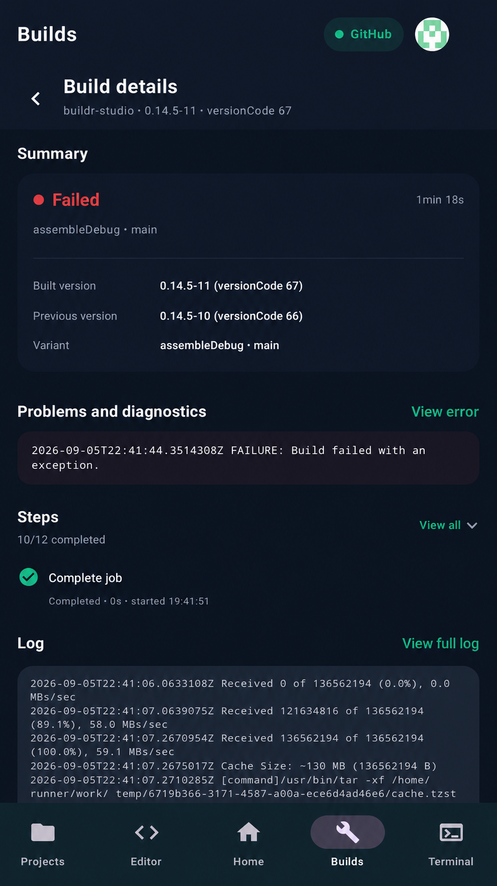
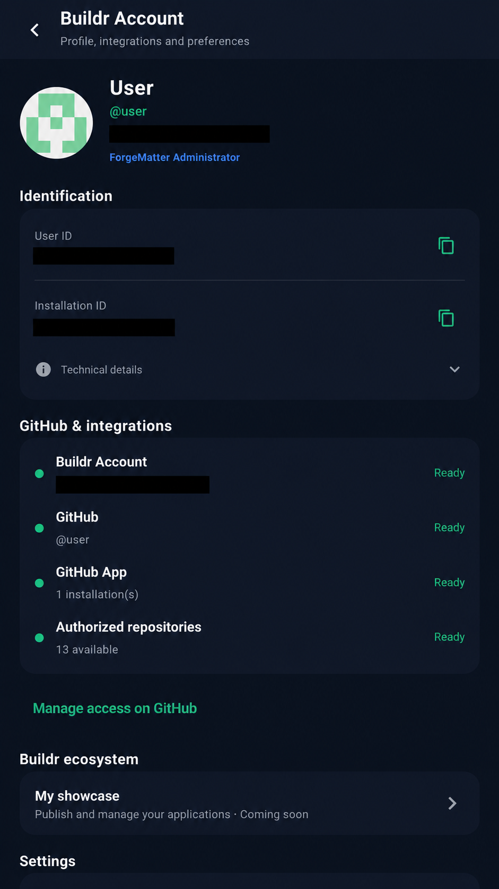

  

  <a href="README.md"><strong>English</strong></a>
  •
  <a href="README.pt-BR.md">Português</a>

  <strong>Build Android apps. From Android.</strong>

  <strong>Buildr Studio</strong> is a mobile-first Android development environment by <strong>ForgeMatter</strong>.

  Create • Edit • Build • Diagnose • Integrate • Ship

---

## What is Buildr Studio?

**Buildr Studio** is being built to make serious Android development possible directly from phones and tablets.

Instead of acting like a companion app, Buildr is meant to be a real mobile workspace for Android projects: create and import projects, edit Kotlin/Java/XML, work with Gradle and GitHub, run builds, inspect logs and artifacts, diagnose failures, and manage release-oriented workflows from a single environment.

> **Current status:** active private development.  
> **Distribution:** no Play Store release is planned right now. Future external testing or public availability should happen through GitHub Releases.

---

## Product status

| Area | Status |
|---|---|
| Project workspace | **Available in development builds** |
| ZIP and GitHub import | **Available in development builds** |
| Project-aware Editor | **Available in development builds** |
| Build history, progress, logs and artifacts | **Available in development builds** |
| Smart project update flow | **Available in development builds** |
| Buildr Account and GitHub integrations | **Available in development builds** |
| Terminal | **Available, expanding** |
| Advanced diagnostics | **In active development** |
| Live View runtime | **In active development** |
| Buildr CLI | **In active development** |
| AI-assisted diagnostics | **Planned** |
| Distribution Assistant | **Planned** |
| Adaptive tablet workspace | **Planned** |
| Buildr Showcase | **Planned** |
| Buildr Community | **Planned** |

Buildr already has real foundations, but some of the most ambitious parts are still under construction.

---

## Home

The Home screen is the starting point for the workspace. It is designed to surface the current Android environment, quick project actions, recent build activity, and future ecosystem areas such as the Buildr Showcase and Community.

  

---

## Projects

Buildr keeps local and GitHub-backed projects in the same workspace.

Current project flows include:

- creating and opening Android projects
- importing ZIP packages
- importing from GitHub
- cloning repositories
- keeping multiple projects in the same workspace
- contextual project actions
- Git-aware project state
- persistent workspace state

  

---

## Editor

The Editor is designed around real Android projects rather than isolated text files.

Current and evolving capabilities include:

- Kotlin, Java and Android XML editing
- syntax highlighting
- line numbers and file tabs
- project tree and file management
- search and replace
- undo and redo
- autosave
- Gradle and Git context
- persistent editor state
- adaptive sidebar behavior
- large-file navigation

The Editor, Terminal and project services operate on the same workspace.

  

---

## Smart project updates

When Buildr detects that an imported ZIP belongs to a project that already exists in the workspace, it can use a safer update flow instead of blindly creating another copy.

That flow is designed to compare versions, detect identity, summarize additions/modifications/removals, and let the user decide how the update should proceed.

  

---

## Builds

Buildr connects the workspace to Android build infrastructure and keeps the execution state visible in the app.

The build experience includes:

- queued and running states
- progress and current stage
- duration
- build history
- success, failure and cancellation states
- artifact discovery
- execution details
- logs
- background state reconciliation

  

---

## Build details

A completed build should tell you what actually happened.

Build detail screens are intended to expose:

- compiled version and previous version
- task and variant
- duration and completed stages
- generated artifacts
- save and share actions
- complete build logs
- compiler diagnostics when available

  

---

## Diagnostics

Buildr is evolving toward IDE-style diagnostics that surface actionable problems instead of generic failure wrappers.

The diagnostic direction includes:

- errors, warnings and informational diagnostics
- file, line and column awareness
- direct navigation back to code
- dedicated Problems / Diagnostics views
- gutter markers and inline highlights
- safer quick-fix flows when appropriate

  

---

## Buildr Account and GitHub integration

Buildr is centered around a dedicated Buildr account plus GitHub integration.

This area is intended to centralize:

- user identity and installation identity
- GitHub account state
- GitHub App connection state
- repository authorization status
- ecosystem entry points such as Buildr Showcase
- preferences and integration management

  

---

## Terminal and Buildr CLI

Buildr already includes a project-connected Terminal and the long-term direction is to make it a first-class development surface.

That direction includes:

- persistent shell sessions
- access to the real project workspace
- shared file state with the Editor
- file and Git operations
- project-aware commands
- a dedicated `buildr` CLI for IDE-integrated workflows

Terminal exists today, but it is still expanding and polishing.

---

## Android and Gradle awareness

Buildr is being shaped around Android project structure instead of treating a repository like a generic folder.

Its project model is designed to understand things such as:

- modules
- Manifest structure
- Gradle configuration
- applicationId / namespace identity
- launch configuration
- variants and tasks
- generated artifacts
- integration state

This Android awareness is what enables features like smart ZIP updates, safer build flows, better diagnostics and future Live View improvements.

---

## What is still coming

Some important parts are planned or still under active development:

- **Live View runtime** for a faithful in-app preview surface
- **AI-assisted diagnostics** with explicit approval before applying fixes
- **Distribution Assistant** for release preparation workflows
- **Adaptive tablet workspace** with richer multi-panel layouts
- **Buildr Showcase** for publishing app pages inside the Buildr ecosystem
- **Buildr Community** tied to the Buildr account ecosystem

These areas are part of the product direction, but they should not be interpreted as already complete.

---

## Development principles

Buildr is being built around a few core ideas:

- mobile first, not mobile only
- one workspace instead of scattered tools
- real Android project awareness
- direct visibility into builds and failures
- GitHub-first project workflows
- progression toward a serious IDE experience on Android

---

## Repository assets

- English banner: `assets/banner-en.png`
- Portuguese banner: `assets/banner-pt-br.png`
- English screenshots: `assets/screenshots/en/`
- Portuguese screenshots: `assets/screenshots/pt-BR/`
- Social previews: `assets/social/`

---

## ForgeMatter

Buildr Studio is a ForgeMatter project.
