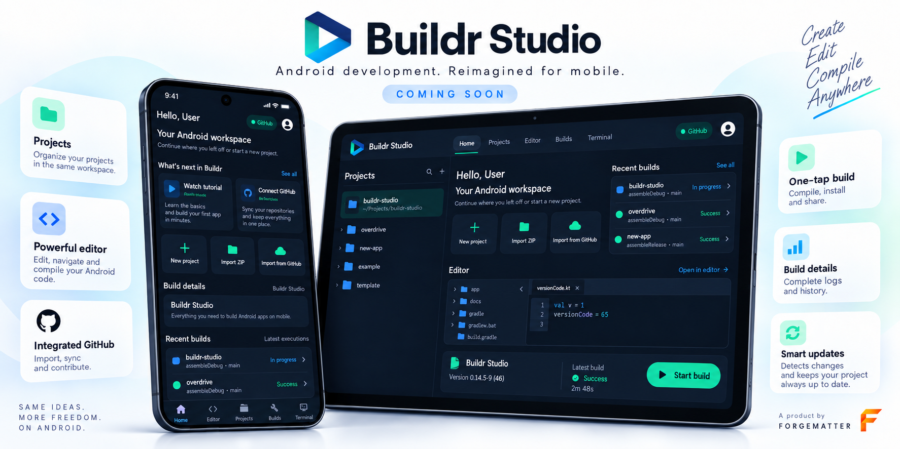
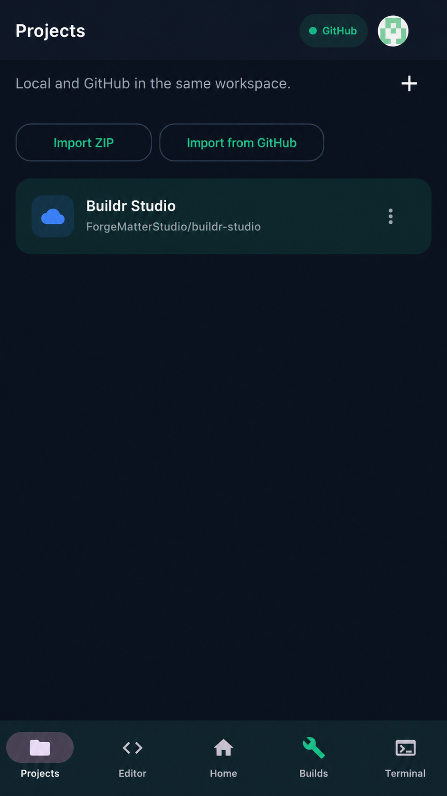
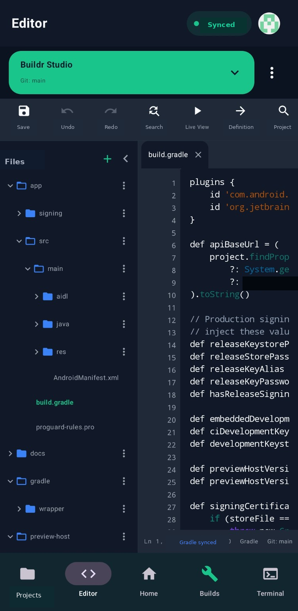
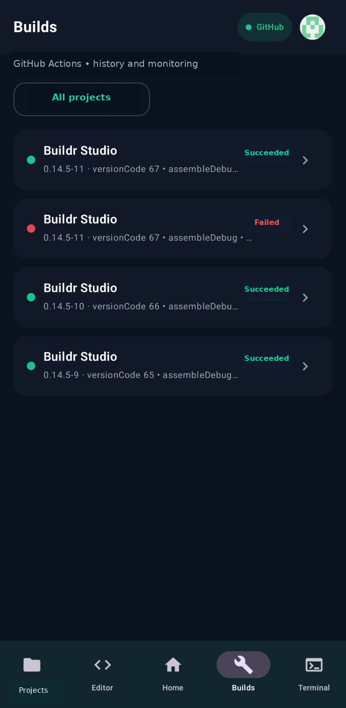
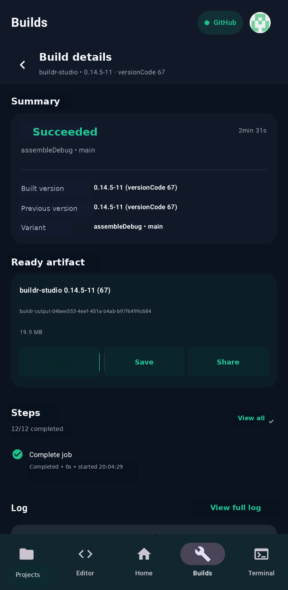
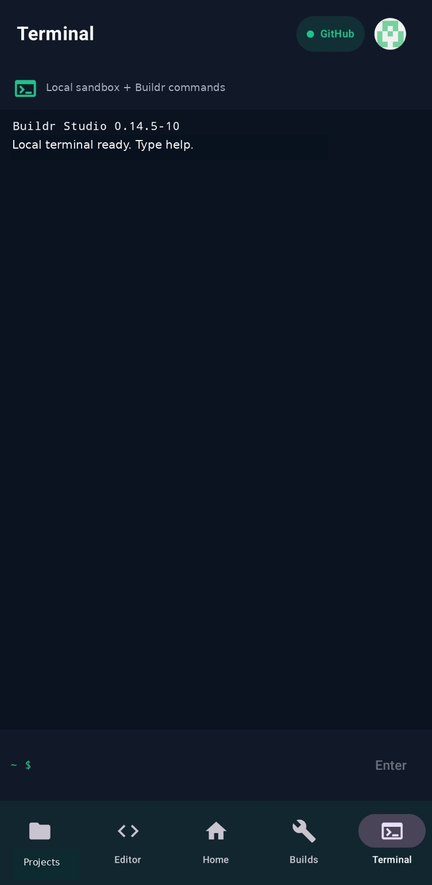
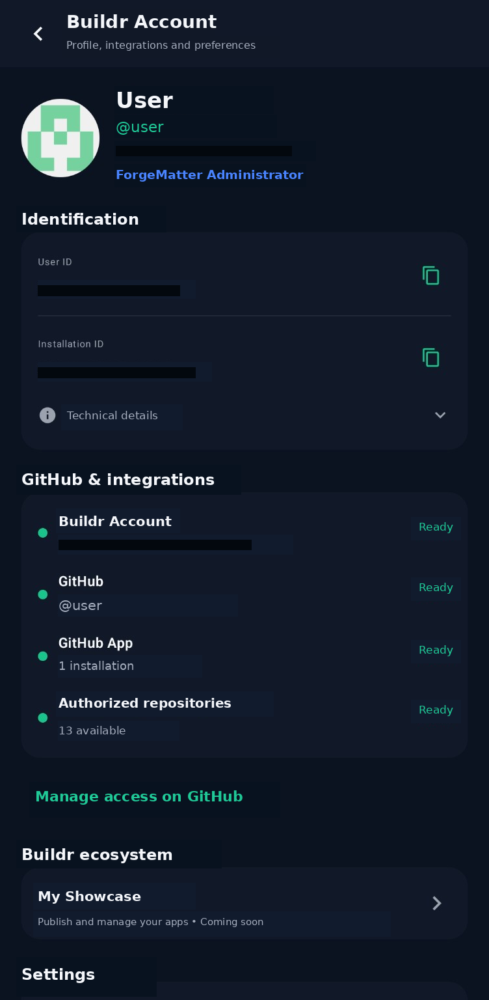

<p align="center">
  
</p>

<p align="center">
  <a href="README.md"><strong>English</strong></a>
  •
  <a href="README.pt-BR.md">Português</a>
</p>

<p align="center">
  <strong>Build Android apps. From Android.</strong>
</p>

<p align="center">
  Buildr Studio is a mobile-first Android development environment by <strong>ForgeMatter</strong>.
</p>

<p align="center">
  Create • Code • Build • Diagnose • Preview • Ship
</p>

---

## What is Buildr Studio?

**Buildr Studio** is being built to make serious Android development possible directly from phones and tablets.

Create Android projects, edit Kotlin, Java and XML, work with Gradle and GitHub, run builds, inspect logs and artifacts, diagnose problems, use a project-aware terminal and prepare applications for distribution — from the same workspace.

Buildr is designed around mobile from the beginning, with an interface adapted to touch, compact screens, keyboards and future larger-screen layouts.

> **Current status:** active private development.  
> Public downloads are not available yet.

---

## Product status

| Area | Status |
|---|---|
| Project workspace | **Available in development builds** |
| ZIP and GitHub project import | **Available in development builds** |
| Project-aware Editor | **Available in development builds** |
| Build history, progress, logs and artifacts | **Available in development builds** |
| Smart project update flow | **Available in development builds** |
| Buildr Account and GitHub integrations | **Available in development builds** |
| Terminal | **Available, expanding** |
| Advanced diagnostics | **In active development** |
| Live View runtime | **In active development** |
| Buildr CLI | **In active development** |
| AI-assisted diagnostics | **Planned** |
| Distribution Assistant | **Planned** |
| Adaptive tablet workspace | **Planned** |
| Buildr Showcase | **Planned** |
| Buildr Community | **Planned** |

Features and UI may change before the first public release.

---

# Projects

## Local and GitHub projects in one workspace

Buildr provides a dedicated workspace for Android projects.

Project workflows include:

- creating and opening Android projects
- importing ZIP packages
- importing from GitHub
- cloning repositories
- keeping multiple projects in the same workspace
- project-specific build configuration
- Git-aware project state
- contextual project actions
- persistent workspace state

Buildr can also recognize when an imported ZIP belongs to an existing project and use a safer update workflow instead of blindly creating another copy.

<p align="center">
  
</p>

---

# Editor

## A project-aware Android editor

The Buildr Editor is designed around real Android projects rather than isolated text files.

Current and evolving capabilities include:

- Kotlin editing
- Java editing
- Android XML editing
- syntax highlighting
- line numbers
- file tabs
- project tree
- file creation and management
- search and replace
- undo and redo
- autosave
- Git context
- Gradle state
- persistent editor state
- adaptive sidebar behavior
- large-file navigation

The Editor, Terminal and project tools operate on the same workspace.

Changes made in one part of Buildr are intended to immediately become visible across the rest of the environment.

<p align="center">
  
</p>

---

# Builds

## Build, monitor and understand what happened

Buildr connects the project workspace to Android build infrastructure and keeps build state visible inside the app.

The build experience includes:

- explicit build confirmation
- queued and running states
- progress
- current build stage
- duration
- build history
- success, failure and cancellation states
- project and version information
- artifact discovery
- execution details
- build logs
- background state reconciliation

A remote build is designed to continue independently from the current Buildr screen.

When the app is opened again, Buildr can reconcile the real state of the execution instead of relying only on stale local UI state.

<p align="center">
  
</p>

---

# Build details

## More than a green checkmark

A completed build should tell you what actually happened.

Buildr can expose:

- compiled version
- previous version
- task
- variant
- duration
- completed stages
- generated artifact
- save and share actions
- complete build logs
- compiler diagnostics when available

The diagnostic pipeline is evolving toward identifying the concrete compiler error — including file, line and column — and providing a direct path back to the Editor.

<p align="center">
  
</p>

---

# Diagnostics

## Find the real problem

Buildr is evolving toward IDE-style diagnostics that appear where developers need them.

The diagnostic system is being developed to support:

- errors
- warnings
- informational diagnostics
- file information
- line and column
- gutter markers
- inline highlighting
- status counters
- Problems / Diagnostics views
- direct navigation to affected code
- safe Quick Fix actions when appropriate

Android-specific analysis includes:

- Kotlin
- Java
- XML
- AndroidManifest
- Gradle
- project configuration

The goal is to move beyond generic messages such as `Compilation failed` and surface the actual actionable problem whenever the compiler provides it.

---

# Android & Gradle intelligence

Buildr understands Android project structure instead of treating a project as a generic folder.

Its project model is designed around information such as:

- modules
- Gradle structure
- `applicationId`
- namespace
- AndroidManifest
- launcher activity
- SDK configuration
- dependencies
- variants
- tasks
- project version
- source structure
- build configuration

Relevant Gradle or Manifest changes can invalidate and refresh related project state.

---

# Smart project updates

When an imported ZIP represents a newer version of a project already available in Buildr, the update workflow can:

- identify the existing project
- compare project identity
- show added files
- show modified files
- show removed files
- create a safety snapshot
- update the existing workspace
- roll back when necessary
- import as a separate copy when requested

The goal is safer project evolution without manually replacing complete project folders.

---

# Terminal

## The same workspace, from the command line

The Buildr Terminal operates on the same project workspace used by the graphical interface.

It is being expanded toward:

- persistent shell sessions
- multiple sessions
- command history
- autocomplete
- file operations
- Git workflows
- project commands
- clickable `file:line` references
- persistent working directory
- shared state with the Editor and project tools

<p align="center">
  
</p>

---

# Buildr CLI

A dedicated `buildr` command-line interface is being developed to expose IDE capabilities directly through the Terminal.

Planned command families include:

```text
buildr project
buildr analyze
buildr problems
buildr sync
buildr build
buildr status
buildr logs
buildr artifact
buildr git
```

The CLI and graphical interface are intended to use the same project state and internal engines.

---

# Buildr Account & GitHub

GitHub is a core part of the Buildr workflow.

Buildr also uses its own account layer for product identity, integrations and future ecosystem features.

The integration model includes:

- Buildr Account
- GitHub connection state
- GitHub App installation
- authorized repositories
- project import
- repository synchronization
- Git-aware project workflows
- build integration
- ecosystem features tied to a Buildr account

<p align="center">
  
</p>

---

# Quick Build

Projects with a valid build configuration are planned to support a fast **Build now** action directly from the Projects area.

Before starting, Buildr can perform a short preflight and identify blockers such as:

- Gradle issues
- invalid Manifest
- missing files
- unavailable GitHub integration
- invalid task or variant
- critical diagnostics
- unresolved project state

Instead of failing without context, Buildr should tell the user what needs attention and where to fix it.

---

# Live View

## See what you are building

**Live View is currently in active development.**

The goal is to preview the real Android application runtime rather than display a fabricated approximation of the interface.

Buildr and the dedicated **Buildr Preview Host** are being developed to:

- resolve the real application launch configuration
- identify the correct module and launcher
- establish an isolated preview runtime
- attach the preview surface to Buildr
- manage resize and lifecycle
- react to project changes

The Preview Host is designed to be distributed together with compatible Buildr Studio versions.

A public screenshot will be added when the real project runtime is ready for presentation.

---

# AI-assisted development

AI-assisted diagnostics are planned as an optional development layer.

When enough technical context is available, Buildr is intended to help with tasks such as:

- explaining build failures
- analyzing compiler diagnostics
- identifying likely root causes
- explaining Gradle problems
- proposing corrections
- generating a suggested patch

AI-generated modifications are not intended to be applied silently.

Proposed changes should remain visible and require explicit user approval.

---

# Distribution Assistant

A future **Distribution Assistant** is planned to help developers prepare Android applications for external distribution.

The workflow is expected to assist with:

- release configuration
- version preparation
- signing
- artifact validation
- release checks
- distribution readiness

**Buildr Studio itself is not planned for distribution through Google Play.**

Official Buildr downloads and releases will be distributed through ForgeMatter-controlled channels.

---

# Mobile first

Buildr starts with the phone experience.

Core development tools are designed to remain useful on compact screens through dedicated areas such as:

- Home
- Projects
- Editor
- Builds
- Terminal

The phone is intended to remain a first-class development environment rather than merely a remote control for a desktop IDE.

---

# Tablet workspace

A richer adaptive workspace is planned for tablets and larger displays.

The expanded experience is expected to support combinations such as:

- persistent project tree
- Editor + Terminal
- docked Terminal
- Problems panel
- build output
- Live View beside the Editor
- resizable panels
- multi-panel development
- keyboard and mouse optimized interactions

The same project, Terminal session and development context should carry across compact and expanded layouts.

---

# Buildr Showcase

## Apps made with Buildr

A future **Buildr Showcase** is planned as a visual catalog for applications created with Buildr Studio.

Developers will be able to present apps with information such as:

- application name
- description
- screenshots
- version
- release information
- developer information
- official distribution links

The Showcase is **not intended to host APK files**.

Applications will point users to official distribution channels selected by their developers.

A future **My Showcase** area is also planned for Buildr accounts.

---

# Buildr Community

A future **Buildr Community** is planned as part of the wider ForgeMatter ecosystem.

The goal is to create a place where developers can:

- discover projects
- exchange Android development knowledge
- share workflows
- help other Buildr users
- discover community resources
- follow Buildr ecosystem updates

The first community experience may use GitHub before deeper integration is introduced inside Buildr.

---

# The Buildr ecosystem

### Buildr Studio
The mobile-first Android development environment.

### Buildr Preview Host
The runtime companion used by advanced preview capabilities.

### Buildr CLI
Terminal access to project and development operations.

### Buildr Showcase
A future catalog for applications created with Buildr.

### Buildr Community
A future space for developers and the wider Buildr ecosystem.

---

# Beta & releases

A public beta is under evaluation and may be released before the first stable version.

Beta builds may be distributed as controlled **pre-releases** and may be replaced or removed as development progresses.

A beta may contain:

- unfinished features
- compatibility limitations
- known issues
- experimental functionality

Removing a beta release does not revoke copies that have already been downloaded.

Official downloads and release information will be published through ForgeMatter-controlled channels.

---

# Current release status

| | |
|---|---|
| **Development** | Private |
| **Public download** | Not available yet |
| **Public beta** | Under evaluation |
| **Stable release** | To be announced |
| **Platform** | Android |
| **Developer** | ForgeMatter |

---

# About ForgeMatter

**ForgeMatter** is an independent software studio building ambitious tools for developers and creators.

**Buildr Studio is a ForgeMatter product.**

---

# About this repository

This is the official public informational repository for Buildr Studio.

It may be used for:

- product information
- screenshots
- development updates
- beta announcements
- public releases
- release notes
- official download information
- Buildr ecosystem announcements

The Buildr Studio source code and internal infrastructure are maintained separately.

---

# Licensing

Buildr Studio is proprietary software.

This repository does not grant permission to copy, modify, redistribute or reuse the Buildr Studio application or its source code.

© 2026 ForgeMatter. All rights reserved.
