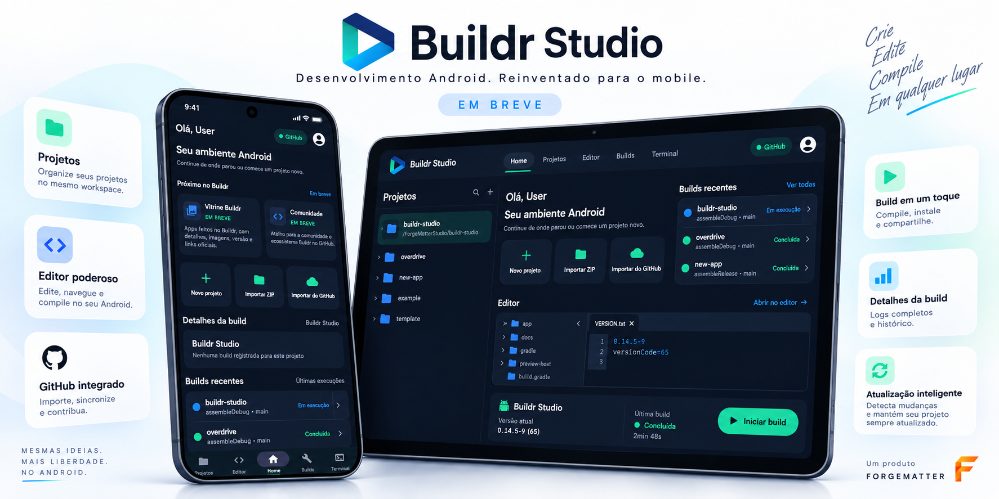
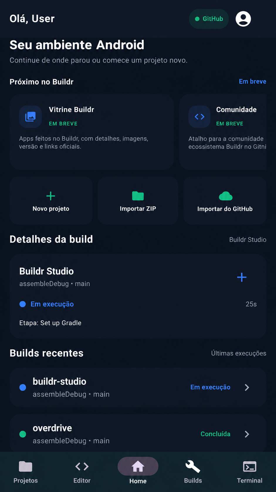
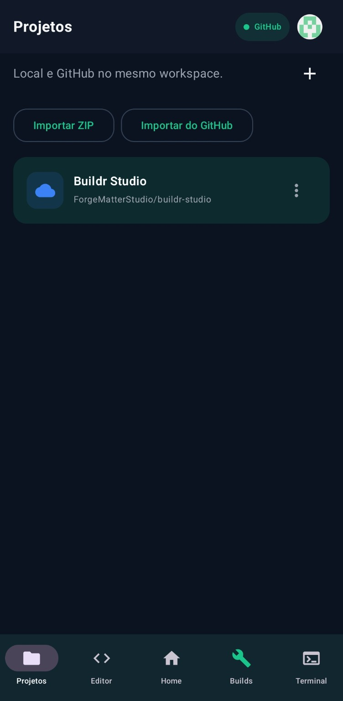
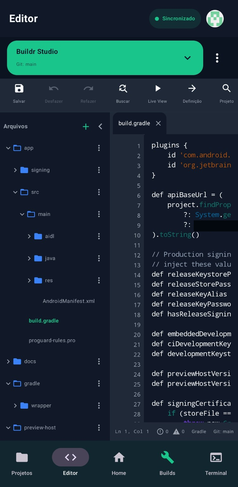
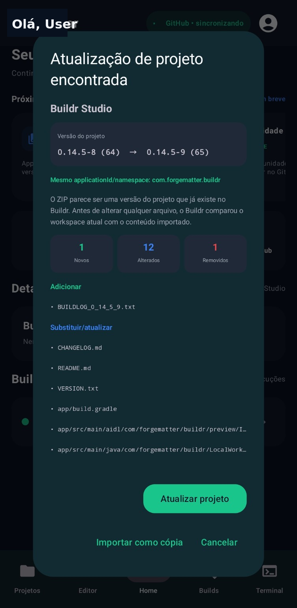
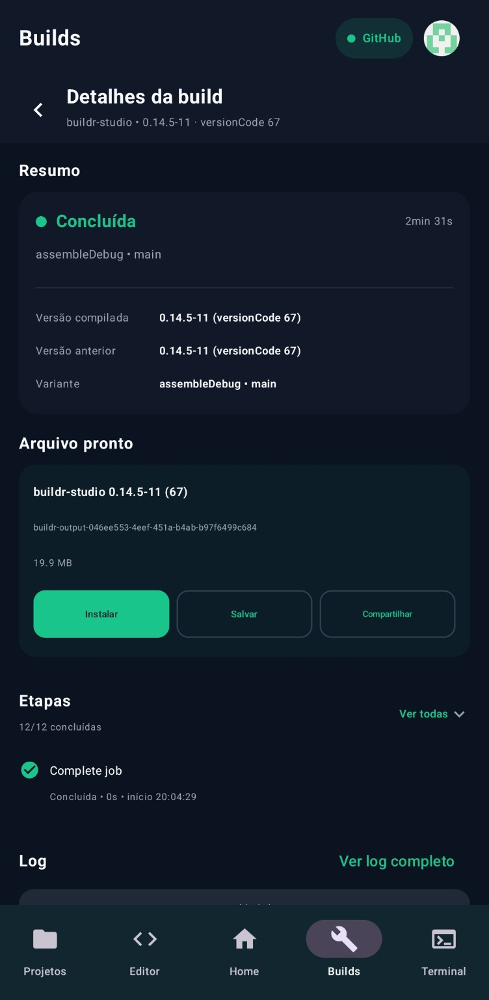
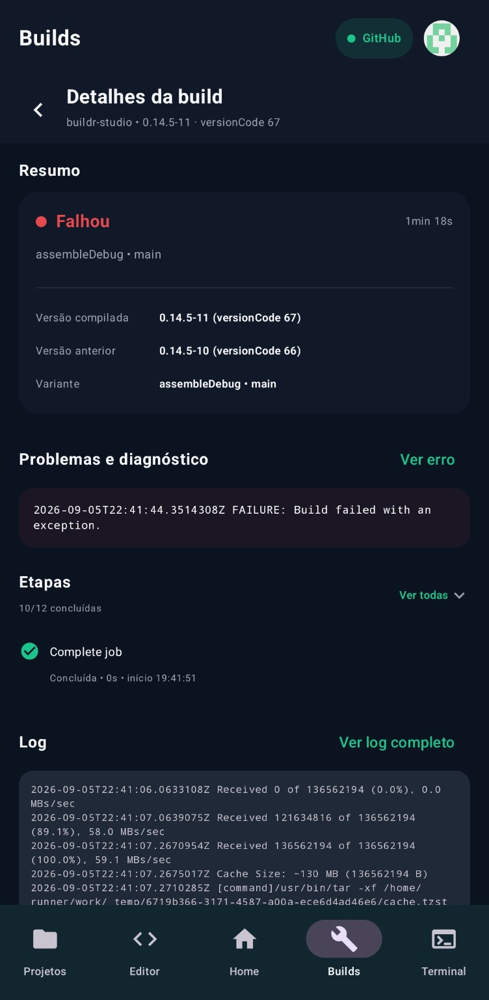
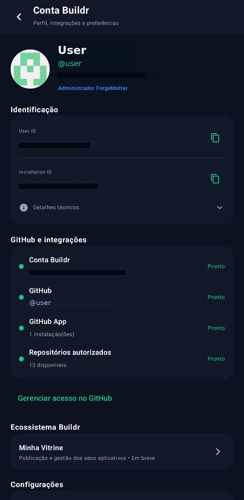

  

  <a href="README.md">English</a>
  •
  <a href="README.pt-BR.md"><strong>Português</strong></a>

  <strong>Crie aplicativos Android. No Android.</strong>

  <strong>Buildr Studio</strong> é um ambiente de desenvolvimento Android mobile-first da <strong>ForgeMatter</strong>.

  Criar • Editar • Compilar • Diagnosticar • Integrar • Distribuir

---

## O que é o Buildr Studio?

O **Buildr Studio** está sendo construído para tornar possível um fluxo sério de desenvolvimento Android diretamente em celulares e tablets.

Em vez de ser apenas um app complementar, o Buildr quer ser um workspace mobile real para projetos Android: criar e importar projetos, editar Kotlin/Java/XML, trabalhar com Gradle e GitHub, executar builds, inspecionar logs e artefatos, diagnosticar falhas e organizar fluxos voltados à distribuição dentro do mesmo ambiente.

> **Status atual:** desenvolvimento privado ativo.  
> **Distribuição:** não há plano de lançar o app na Play Store neste momento. Futuras fases de teste ou disponibilidade externa devem acontecer via GitHub Releases.

---

## Estado do produto

| Área | Estado |
|---|---|
| Workspace de projetos | **Disponível nas builds de desenvolvimento** |
| Importação de ZIP e GitHub | **Disponível nas builds de desenvolvimento** |
| Editor consciente do projeto | **Disponível nas builds de desenvolvimento** |
| Histórico, progresso, logs e artefatos de builds | **Disponível nas builds de desenvolvimento** |
| Atualização inteligente de projetos | **Disponível nas builds de desenvolvimento** |
| Conta Buildr e integrações GitHub | **Disponível nas builds de desenvolvimento** |
| Terminal | **Disponível, em expansão** |
| Diagnósticos avançados | **Em desenvolvimento ativo** |
| Runtime do Live View | **Em desenvolvimento ativo** |
| CLI Buildr | **Em desenvolvimento** |
| Diagnóstico assistido por IA | **Planejado** |
| Assistente de Distribuição | **Planejado** |
| Workspace adaptativo para tablets | **Planejado** |
| Vitrine Buildr | **Planejado** |
| Comunidade Buildr | **Planejado** |

O Buildr já possui bases reais funcionando, mas algumas das partes mais ambiciosas ainda estão em construção.

---

## Home

A Home é o ponto de partida do workspace. Ela foi pensada para reunir o estado atual do ambiente Android, atalhos rápidos de projeto, atividade recente de builds e futuras áreas do ecossistema, como a Vitrine Buildr e a Comunidade.

  

---

## Projetos

O Buildr mantém projetos locais e conectados ao GitHub no mesmo workspace.

Os fluxos atuais incluem:

- criar e abrir projetos Android
- importar ZIPs
- importar do GitHub
- clonar repositórios
- manter múltiplos projetos no mesmo workspace
- ações contextuais por projeto
- estado consciente de Git
- persistência do workspace

  

---

## Editor

O Editor foi pensado em torno de projetos Android reais, e não de arquivos soltos.

Entre os recursos atuais e em evolução estão:

- edição de Kotlin, Java e XML Android
- destaque de sintaxe
- números de linha e abas de arquivo
- árvore do projeto e gerenciamento de arquivos
- busca e substituição
- desfazer e refazer
- salvamento automático
- contexto de Gradle e Git
- persistência do estado do Editor
- comportamento adaptativo da sidebar
- navegação em arquivos extensos

Editor, Terminal e serviços de projeto trabalham sobre o mesmo workspace.

  

---

## Atualização inteligente de projeto

Quando o Buildr detecta que um ZIP importado pertence a um projeto que já existe no workspace, ele pode usar um fluxo de atualização mais seguro em vez de criar outra cópia às cegas.

Esse fluxo foi desenhado para comparar versões, detectar identidade, resumir adições/modificações/remoções e deixar a decisão final com o usuário.

  

---

## Builds

O Buildr conecta o workspace à infraestrutura de compilação Android e mantém o estado das execuções visível dentro do app.

A experiência de build inclui:

- estados em fila e em execução
- progresso e etapa atual
- duração
- histórico de builds
- sucesso, falha e cancelamento
- descoberta de artefatos
- detalhes da execução
- logs
- reconciliação de estado em segundo plano

  

---

## Detalhes da build

Uma build concluída precisa mostrar o que realmente aconteceu.

As telas de detalhe foram pensadas para expor:

- versão compilada e versão anterior
- task e variante
- duração e etapas concluídas
- artefatos gerados
- ações para salvar e compartilhar
- log completo
- diagnósticos do compilador quando disponíveis

  

---

## Diagnósticos

O Buildr está evoluindo para um sistema de diagnóstico mais próximo de uma IDE, com foco em mostrar o problema acionável em vez de apenas mensagens genéricas de falha.

A direção dos diagnósticos inclui:

- erros, warnings e diagnósticos informativos
- noção de arquivo, linha e coluna
- navegação direta de volta ao código
- telas dedicadas de Problemas / Diagnóstico
- marcadores no gutter e realces inline
- fluxos de quick fix mais seguros quando apropriado

  

---

## Conta Buildr e integração com GitHub

O Buildr se apoia em uma Conta Buildr dedicada e na integração com o GitHub.

Essa área foi pensada para centralizar:

- identidade do usuário e da instalação
- estado da conta GitHub
- estado da conexão do GitHub App
- status de autorização de repositórios
- portas de entrada do ecossistema, como a Vitrine Buildr
- preferências e gerenciamento de integrações

  

---

## Terminal e CLI Buildr

O Buildr já possui um Terminal conectado ao projeto, e a direção de longo prazo é transformá-lo em uma superfície de desenvolvimento de primeira classe.

Essa direção inclui:

- sessões persistentes de shell
- acesso ao workspace real do projeto
- estado de arquivos compartilhado com o Editor
- operações de arquivo e Git
- comandos conscientes do projeto
- uma CLI `buildr` dedicada para fluxos integrados à IDE

O Terminal já existe hoje, mas ainda está em expansão e polimento.

---

## Consciência de Android e Gradle

O Buildr está sendo modelado em torno da estrutura real de projetos Android, e não como se um repositório fosse apenas uma pasta genérica.

O modelo de projeto busca compreender informações como:

- módulos
- estrutura do Manifest
- configuração do Gradle
- identidade applicationId / namespace
- configuração de inicialização
- variantes e tasks
- artefatos gerados
- estado das integrações

É essa consciência de Android que viabiliza recursos como atualização inteligente via ZIP, fluxos de build mais seguros, diagnósticos melhores e a evolução futura do Live View.

---

## O que ainda está por vir

Há partes importantes planejadas ou ainda em desenvolvimento ativo:

- **Runtime do Live View** para uma superfície fiel de visualização dentro do app
- **Diagnóstico assistido por IA** com aprovação explícita antes de aplicar correções
- **Assistente de Distribuição** para fluxos de preparação de release
- **Workspace adaptativo para tablets** com layouts multi-painel mais ricos
- **Vitrine Buildr** para páginas de apps dentro do ecossistema Buildr
- **Comunidade Buildr** conectada ao ecossistema da Conta Buildr

Essas áreas fazem parte da direção do produto, mas não devem ser interpretadas como já prontas.

---

## Princípios de desenvolvimento

O Buildr está sendo construído sobre algumas ideias centrais:

- mobile first, e não mobile limitado
- um workspace unificado em vez de ferramentas espalhadas
- consciência real de projeto Android
- visibilidade direta sobre builds e falhas
- fluxos GitHub-first
- evolução rumo a uma experiência de IDE séria no Android

---

## Assets do repositório

- Banner em inglês: `assets/banner-en.png`
- Banner em português: `assets/banner-pt-br.png`
- Screenshots em inglês: `assets/screenshots/en/`
- Screenshots em português: `assets/screenshots/pt-BR/`
- Social previews: `assets/social/`

---

## ForgeMatter

Buildr Studio é um projeto da ForgeMatter.
