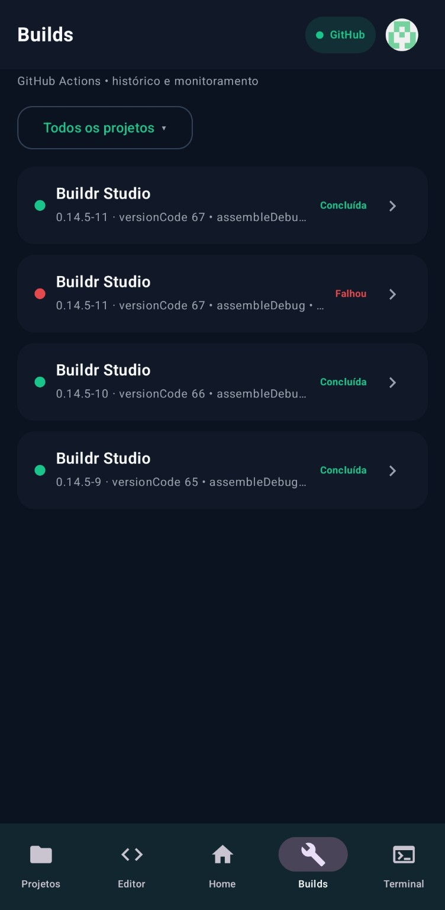
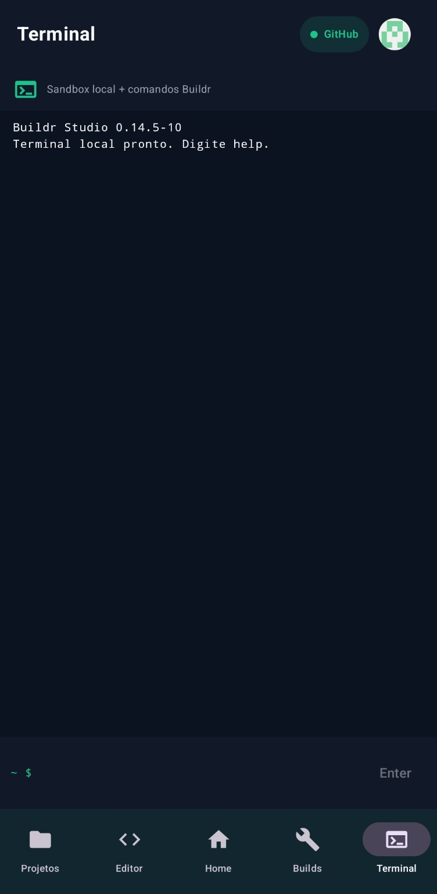

<p align="center">
  
</p>

<p align="center">
  <a href="README.md">English</a>
  •
  <a href="README.pt-BR.md"><strong>Português</strong></a>
</p>

<p align="center">
  <strong>Crie aplicativos Android. No Android.</strong>
</p>

<p align="center">
  Buildr Studio é um ambiente de desenvolvimento Android mobile-first criado pela <strong>ForgeMatter</strong>.
</p>

<p align="center">
  Criar • Codificar • Compilar • Diagnosticar • Visualizar • Distribuir
</p>

---

## O que é o Buildr Studio?

O **Buildr Studio** está sendo construído para tornar possível um fluxo sério de desenvolvimento Android diretamente em celulares e tablets.

Crie projetos Android, edite Kotlin, Java e XML, trabalhe com Gradle e GitHub, execute builds, analise logs e artefatos, diagnostique problemas, use um terminal conectado ao projeto e prepare aplicativos para distribuição — dentro do mesmo ambiente.

O Buildr nasce pensado para mobile, com uma interface adaptada a toque, telas compactas, teclado e futuras experiências para telas maiores.

> **Status atual:** desenvolvimento privado ativo.  
> Ainda não há download público.

---

## Estado do produto

| Área | Estado |
|---|---|
| Workspace de projetos | **Disponível nas builds de desenvolvimento** |
| Importação de ZIP e GitHub | **Disponível nas builds de desenvolvimento** |
| Editor consciente do projeto | **Disponível nas builds de desenvolvimento** |
| Histórico, progresso, logs e artefatos de builds | **Disponível nas builds de desenvolvimento** |
| Atualização inteligente de projetos | **Disponível nas builds de desenvolvimento** |
| Conta Buildr e integrações GitHub | **Disponível nas builds de desenvolvimento** |
| Terminal | **Disponível, em expansão** |
| Diagnósticos avançados | **Em desenvolvimento ativo** |
| Runtime do Live View | **Em desenvolvimento ativo** |
| CLI Buildr | **Em desenvolvimento** |
| Diagnóstico assistido por IA | **Planejado** |
| Assistente de Distribuição | **Planejado** |
| Workspace adaptativo para tablets | **Planejado** |
| Vitrine Buildr | **Planejado** |
| Comunidade Buildr | **Planejado** |

Recursos e interface podem mudar antes da primeira versão pública.

---

# Projetos

## Projetos locais e GitHub no mesmo workspace

O Buildr possui uma área dedicada ao gerenciamento de projetos Android.

Os fluxos incluem:

- criação e abertura de projetos Android
- importação de ZIP
- importação do GitHub
- clonagem de repositórios
- múltiplos projetos no mesmo workspace
- configuração de build por projeto
- estado consciente de Git
- ações contextuais
- persistência do workspace

O Buildr também pode reconhecer quando um ZIP importado pertence a um projeto já existente e utilizar um fluxo de atualização mais seguro em vez de simplesmente criar outra cópia.

<p align="center">
  
</p>

---

# Editor

## Um editor consciente do projeto Android

O Editor do Buildr foi desenvolvido em torno de projetos Android reais, e não de arquivos de texto isolados.

Entre os recursos atuais e em evolução estão:

- Kotlin
- Java
- XML Android
- destaque de sintaxe
- números de linha
- abas de arquivos
- árvore do projeto
- criação e gerenciamento de arquivos
- busca e substituição
- desfazer e refazer
- salvamento automático
- contexto Git
- estado do Gradle
- persistência do Editor
- sidebar adaptativa
- navegação em arquivos extensos

Editor, Terminal e ferramentas de projeto trabalham sobre o mesmo workspace.

Alterações feitas em uma parte do Buildr devem refletir imediatamente no restante do ambiente.

<p align="center">
  
</p>

---

# Builds

## Compile, acompanhe e entenda o que aconteceu

O Buildr conecta o workspace à infraestrutura de compilação Android e mantém o estado das builds visível dentro do aplicativo.

A experiência inclui:

- confirmação explícita
- estado em fila e em execução
- progresso
- etapa atual
- duração
- histórico
- sucesso, falha e cancelamento
- informações de projeto e versão
- descoberta de artefatos
- detalhes da execução
- logs
- reconciliação de estado em segundo plano

Uma build remota foi projetada para continuar independentemente da tela atual do Buildr.

Ao retornar ao aplicativo, o estado real da execução pode ser reconciliado em vez de depender apenas da interface local anterior.

<p align="center">
  
</p>

---

# Detalhes da build

## Mais do que um check verde

Uma build concluída deve informar o que realmente aconteceu.

O Buildr pode apresentar:

- versão compilada
- versão anterior
- task
- variante
- duração
- etapas concluídas
- artefato gerado
- ações para salvar e compartilhar
- log completo
- diagnósticos do compilador quando disponíveis

O pipeline de diagnóstico está evoluindo para encontrar o erro concreto do compilador — incluindo arquivo, linha e coluna — e fornecer um caminho direto de volta ao Editor.

<p align="center">
  
</p>

---

# Diagnósticos

## Encontre o problema real

O Buildr está evoluindo para um sistema de diagnóstico no nível de uma IDE.

O sistema está sendo desenvolvido para oferecer:

- erros
- warnings
- diagnósticos informativos
- arquivo
- linha e coluna
- marcadores no gutter
- realce inline
- contadores de status
- telas de Problemas / Diagnóstico
- navegação direta ao código afetado
- Quick Fix seguro quando apropriado

A análise Android inclui:

- Kotlin
- Java
- XML
- AndroidManifest
- Gradle
- configuração do projeto

O objetivo é ultrapassar mensagens genéricas como `Compilation failed` e mostrar o problema real sempre que o compilador fornecer informações suficientes.

---

# Inteligência Android e Gradle

O Buildr compreende a estrutura de um projeto Android em vez de tratá-lo como uma pasta genérica.

Seu modelo de projeto é desenvolvido em torno de informações como:

- módulos
- estrutura Gradle
- `applicationId`
- namespace
- AndroidManifest
- Activity de inicialização
- SDK
- dependências
- variantes
- tasks
- versão
- estrutura de código
- configuração de build

Mudanças relevantes em Gradle ou Manifest podem invalidar e atualizar o estado relacionado do projeto.

---

# Atualização inteligente de projetos

Quando um ZIP importado representa uma versão mais nova de um projeto já existente, o Buildr pode:

- identificar o projeto
- comparar sua identidade
- mostrar arquivos adicionados
- mostrar arquivos modificados
- mostrar arquivos removidos
- criar snapshot de segurança
- atualizar o workspace existente
- realizar rollback quando necessário
- importar como cópia separada quando solicitado

O objetivo é tornar a evolução do projeto mais segura sem exigir substituição manual de pastas completas.

---

# Terminal

## O mesmo workspace pela linha de comando

O Terminal do Buildr opera sobre o mesmo workspace utilizado pela interface gráfica.

Ele está sendo expandido em direção a:

- sessões persistentes
- múltiplas sessões
- histórico
- autocomplete
- operações de arquivos
- fluxos Git
- comandos de projeto
- referências clicáveis `arquivo:linha`
- diretório de trabalho persistente
- estado compartilhado com o Editor e ferramentas de projeto

<p align="center">
  
</p>

---

# CLI Buildr

Uma CLI própria chamada `buildr` está sendo desenvolvida para expor funções da IDE diretamente pelo Terminal.

Entre as famílias de comandos planejadas:

```text
buildr project
buildr analyze
buildr problems
buildr sync
buildr build
buildr status
buildr logs
buildr artifact
buildr git
```

CLI e interface gráfica devem utilizar o mesmo estado do projeto e os mesmos motores internos.

---

# Conta Buildr e GitHub

O GitHub é parte central do fluxo do Buildr.

O Buildr também utiliza uma camada própria de conta para identidade, integrações e futuros recursos do ecossistema.

O modelo inclui:

- Conta Buildr
- estado da conexão GitHub
- instalação do GitHub App
- repositórios autorizados
- importação de projetos
- sincronização
- fluxos conscientes do repositório
- integração com builds
- futuros recursos vinculados à Conta Buildr

<p align="center">
  
</p>

---

# Build rápida

Projetos com uma configuração de build válida poderão oferecer uma ação **Compilar agora** diretamente na área Projetos.

Antes de iniciar, o Buildr poderá executar um preflight curto e identificar bloqueios como:

- erro no Gradle
- Manifest inválido
- arquivos ausentes
- GitHub indisponível
- task ou variante inválida
- diagnósticos críticos
- estado inconsistente do projeto

Em vez de simplesmente recusar a compilação, o Buildr deverá informar o que precisa de atenção e onde resolver.

---

# Live View

## Veja o que está construindo

O **Live View está atualmente em desenvolvimento ativo**.

O objetivo é visualizar o runtime real do aplicativo Android em vez de apresentar uma aproximação fabricada da interface.

O Buildr e o **Buildr Preview Host** estão sendo desenvolvidos para:

- resolver a configuração real de inicialização
- identificar módulo e launcher
- estabelecer um runtime isolado de preview
- anexar a superfície ao Buildr
- gerenciar tamanho e ciclo de vida
- reagir às alterações do projeto

O Preview Host foi projetado para ser distribuído junto com versões compatíveis do Buildr Studio.

Um screenshot público será adicionado quando o runtime real do projeto estiver pronto para apresentação.

---

# Desenvolvimento assistido por IA

Diagnósticos assistidos por IA estão planejados como uma camada opcional de desenvolvimento.

Quando houver contexto técnico suficiente, o Buildr deverá auxiliar em tarefas como:

- explicar falhas de build
- analisar diagnósticos do compilador
- identificar causas prováveis
- explicar problemas de Gradle
- propor correções
- gerar um patch sugerido

Alterações geradas por IA não deverão ser aplicadas silenciosamente.

Mudanças propostas deverão permanecer visíveis e exigir aprovação explícita do usuário.

---

# Assistente de Distribuição

Um futuro **Assistente de Distribuição** está planejado para ajudar desenvolvedores a preparar aplicativos Android para distribuição externa.

O fluxo deverá auxiliar em:

- configuração de release
- preparação de versão
- assinatura
- validação de artefatos
- verificações de release
- prontidão para distribuição

**O próprio Buildr Studio não está planejado para distribuição pela Google Play.**

Downloads e releases oficiais do Buildr serão distribuídos através de canais controlados pela ForgeMatter.

---

# Mobile first

O Buildr começa pela experiência no celular.

As ferramentas essenciais são projetadas para permanecer úteis em telas compactas através de áreas próprias como:

- Home
- Projetos
- Editor
- Builds
- Terminal

A proposta é que o celular permaneça um ambiente de desenvolvimento de primeira classe, e não apenas um controle remoto para uma IDE de desktop.

---

# Workspace para tablets

Um workspace adaptativo mais rico está planejado para tablets e telas maiores.

A experiência expandida deverá permitir combinações como:

- árvore de arquivos persistente
- Editor + Terminal
- Terminal dockado
- painel Problemas
- saída de build
- Live View ao lado do Editor
- painéis redimensionáveis
- desenvolvimento multipainel
- interações otimizadas para teclado e mouse

Projeto, sessão do Terminal e contexto de desenvolvimento devem continuar os mesmos entre layouts compactos e expandidos.

---

# Vitrine Buildr

## Aplicativos feitos com Buildr

Uma futura **Vitrine Buildr** está planejada como catálogo visual de aplicativos criados com o Buildr Studio.

Desenvolvedores poderão apresentar seus aplicativos com informações como:

- nome
- descrição
- screenshots
- versão
- informações de release
- desenvolvedor
- links oficiais de distribuição

A Vitrine **não será um serviço de hospedagem de APKs**.

Cada aplicativo apontará para canais oficiais escolhidos pelo próprio desenvolvedor.

Uma futura área **Minha Vitrine** também está planejada para Contas Buildr.

---

# Comunidade Buildr

Uma futura **Comunidade Buildr** está planejada como parte do ecossistema ForgeMatter.

O objetivo é criar um espaço onde desenvolvedores possam:

- descobrir projetos
- trocar conhecimento sobre desenvolvimento Android
- compartilhar fluxos de trabalho
- ajudar outros usuários
- encontrar recursos
- acompanhar novidades do ecossistema Buildr

A primeira experiência poderá utilizar o GitHub antes de evoluir para uma integração mais profunda dentro do Buildr.

---

# Ecossistema Buildr

### Buildr Studio
O ambiente de desenvolvimento Android mobile-first.

### Buildr Preview Host
O componente de runtime utilizado pelas capacidades avançadas de preview.

### Buildr CLI
Acesso pelo Terminal às operações de projeto e desenvolvimento.

### Vitrine Buildr
O futuro catálogo de aplicativos criados com Buildr.

### Comunidade Buildr
O futuro espaço para desenvolvedores e para o ecossistema.

---

# Beta e releases

Uma beta pública está em avaliação e poderá ser lançada antes da primeira versão estável.

Builds beta poderão ser distribuídas como **pre-releases controladas** e poderão ser substituídas ou retiradas conforme o desenvolvimento avançar.

Uma beta poderá conter:

- recursos inacabados
- limitações de compatibilidade
- problemas conhecidos
- funcionalidades experimentais

A remoção de uma release beta não revoga cópias que já tenham sido baixadas.

Downloads oficiais e informações de release serão publicados através de canais controlados pela ForgeMatter.

---

# Status atual de lançamento

| | |
|---|---|
| **Desenvolvimento** | Privado |
| **Download público** | Ainda indisponível |
| **Beta pública** | Em avaliação |
| **Versão estável** | A anunciar |
| **Plataforma** | Android |
| **Desenvolvedor** | ForgeMatter |

---

# Sobre a ForgeMatter

**ForgeMatter** é um estúdio independente de software focado em criar ferramentas ambiciosas para desenvolvedores e criadores.

**Buildr Studio é um produto ForgeMatter.**

---

# Sobre este repositório

Este é o repositório público informativo oficial do Buildr Studio.

Ele poderá ser utilizado para:

- informações sobre o produto
- screenshots
- atualizações de desenvolvimento
- anúncios de beta
- releases públicas
- notas de versão
- downloads oficiais
- novidades do ecossistema Buildr

O código-fonte e a infraestrutura interna do Buildr Studio são mantidos separadamente.

---

# Licenciamento

Buildr Studio é um software proprietário.

Este repositório não concede permissão para copiar, modificar, redistribuir ou reutilizar o aplicativo Buildr Studio ou seu código-fonte.

© 2026 ForgeMatter. Todos os direitos reservados.
